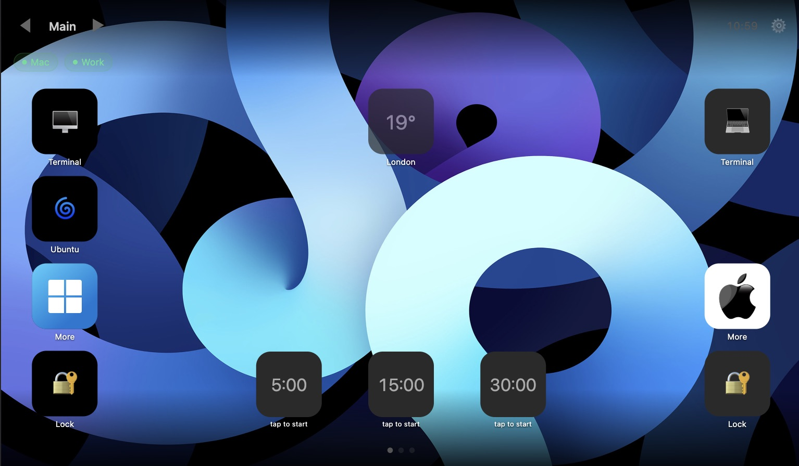
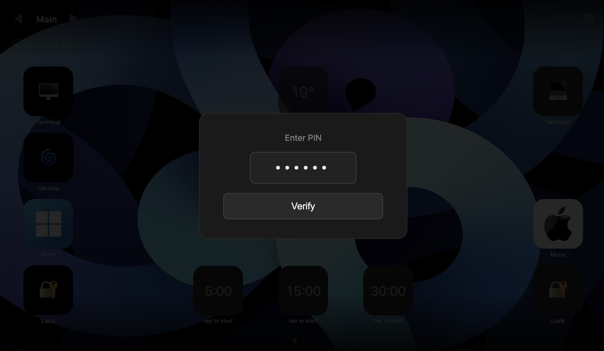
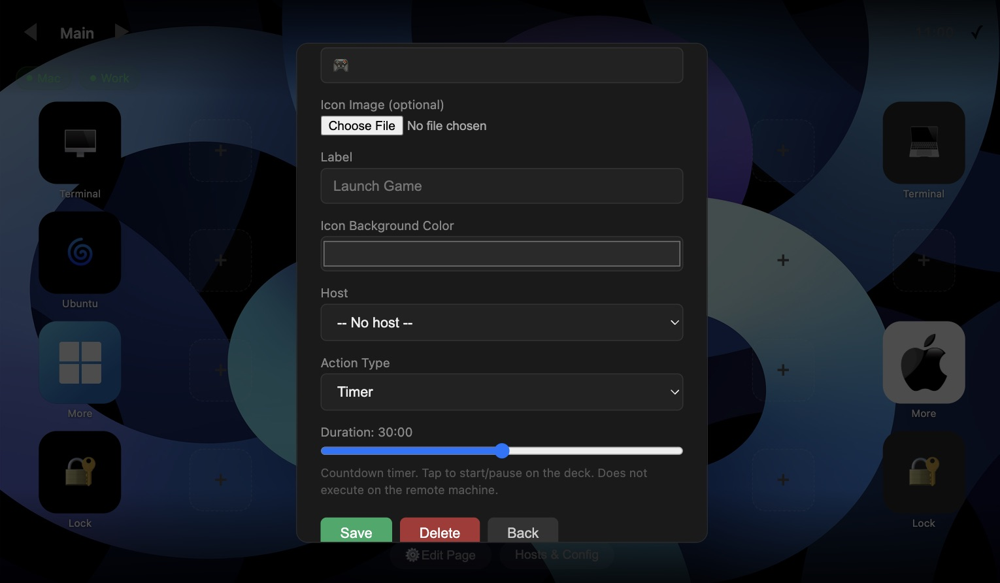
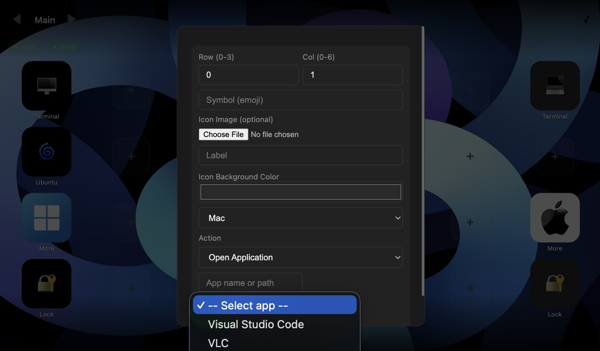
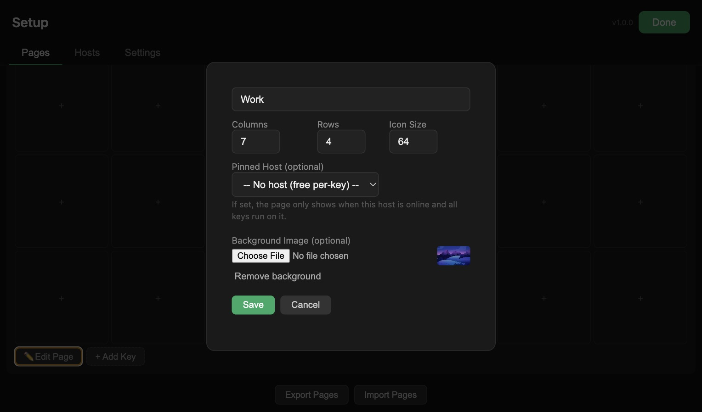
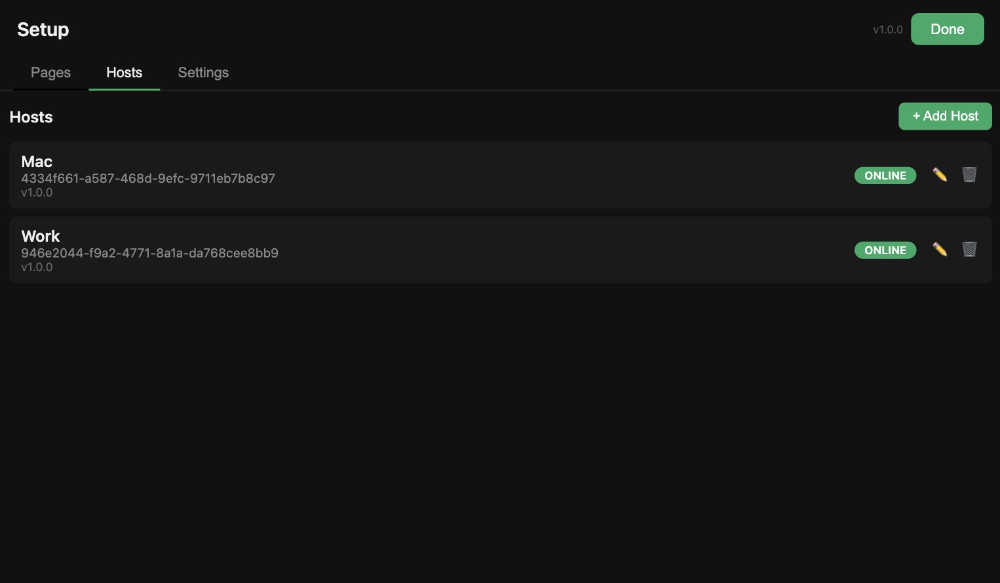
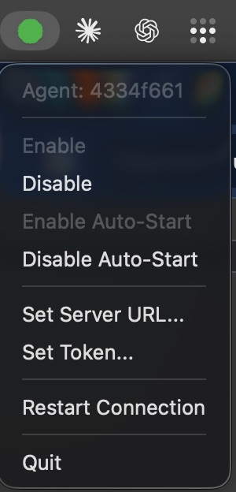

# NotStreamDeck

Remote-controlled action grid for your desktop. Assign shortcuts, app launches, shell commands, media controls, and more to a mobile-friendly grid — executed on any networked machine via a lightweight Rust agent.

## Approach

A Rust daemon runs in the background on each target machine, connected via WebSocket to a central Node.js server. The web UI serves a configurable action grid (pages, keys, host pinning) that works on phones, tablets, and desktops. The agent handles execution locally — no screen sharing, no remote desktop, just instant action.

## Outcome

Live on your LAN, cross-platform, with 11 action types, 13 screensaver modes, multi-page grids, IP access control, and import/export. MIT licensed.

## Screenshots

<table>
  <tr>
    <td><br/><em>Main deck view</em></td>
    <td><br/><em>PIN code modal</em></td>
    <td><br/><em>Timer key editor</em></td>
  </tr>
  <tr>
    <td><br/><em>App key creator (macOS)</em></td>
    <td><br/><em>Pages settings</em></td>
    <td><br/><em>Host management</em></td>
  </tr>
  <tr>
    <td><br/><em>macOS agent in menu bar</em></td>
    <td></td>
    <td></td>
  </tr>
</table>

## Architecture

```
┌─────────────────────┐     WebSocket      ┌──────────────────────┐
│  Rust Agent         │◄──────────────────►│  Control Server      │
│  (one per machine)  │   :8080            │  Express + ws        │
│                     │                    │  :3000 (HTTP + WS)   │
│  - Receives cmds    │                    │  :8080 (agent WS)    │
│  - Executes actions │                    │                      │
│  - Reports status   │                    │  React Frontend      │
└─────────────────────┘                    │  (served as static)  │
                                           └──────────────────────┘
```

**Agent** — Rust binary, no Electron/Node runtime, one binary per OS, connects to the control server via WebSocket, authenticates with a shared token, executes commands on the host machine.

**Control Server** — Node.js Express server with dual WebSocket (agents on `:8080`, frontends on `:3000/ws`), JSON file persistence in `data.json`, serves the React frontend.

## Ports

All ports are adjustable via environment variables or `data.json`:

| Port | Default | Env Var | data.json key | Purpose |
|------|---------|---------|---------------|---------|
| HTTP | `3000` | `PORT` or `HTTP_PORT` | `http_port` | Control server (frontend + REST) |
| Agent WS | `8080` | `WS_PORT` | `ws_port` | Agent WebSocket |

**Priority**: environment variable → `data.json` → default value.

To run on different ports:

```bash
PORT=8080 WS_PORT=9090 node server.js
# HTTP on :8080, Agent WS on :9090
```

The agent connects to `ws://<server>:<ws_port>`. Configure the agent's `server_url` via the system tray menu ("Set Server URL...") or by editing `config.json`:

```json
{
  "server_url": "ws://192.168.1.50:9090",
  "token": "shared-secret",
  ...
}
```

## Features

### Key Types (11)
| Type | Description |
|------|-------------|
| `open_app` | Launch an application (dropdown of installed apps fetched from agent) |
| `shell` | Run any shell command |
| `hotkey` | Simulate keyboard shortcuts (Cmd+C, Ctrl+Alt+Del, etc.) |
| `clipboard` | Copy text to clipboard |
| `volume` | Set system volume (0–100) |
| `lock` | Lock the screen |
| `timer` | Client-side countdown (5–3600s), tap to start/pause |
| `weather` | Display weather for a location (fetches from wttr.in) |
| `macro` | Sequence of sub-actions executed in order |
| `navigate` | Frontend-only page navigation (home/next/prev/by name/by index) |
| `media` | Media playback control (play/pause, next, previous) |

### Grid & Pages
- Fixed-size rounded icons with labels, no button borders
- Background image per page
- CSS Grid layout with configurable columns/rows
- Page-level host pinning (page only shows when host is online)
- Keys grey out when target host is offline

### Host Management
- Auto-register hosts on agent connection (WebSocket hello with device_id + token)
- Host status tracking (online/offline, last seen, version)
- Version tracking — outdated agents shown with ❗ indicator
- Manual add/edit/delete hosts

### Lock Screen & Access Control
- Server-side PIN verification (`POST /api/verify-pin`) — default PIN: `000000`
- IP whitelist — non-whitelisted IPs see a lock screen
- PIN unlocks edit mode or opens full setup
- Screensaver hidden when IP-restricted

### Screensaver (13 Modes)
Digital Clock, Ambient Gradient, Weather, Icon Slideshow, Starfield, Network Pulse, Date & Quote, Photo Slideshow, Bouncing Logo, **Fireworks**, **Aurora**, **Rainbow**, **Plasma**, Cycle All. Configurable timeout (5-300s) and dim overlay opacity (30-100%) in Settings.

### Import / Export
Export all pages and keys as a JSON file, import to restore or transfer configurations between instances.

### Agent

- System tray with Enable/Disable, Set Server URL/Token, Restart, Quit
- Tray label shows device ID prefix (first 8 chars) for easy identification across multiple agents
- Tooltip shows device ID + connection status

| Feature | macOS | Windows |
|---------|-------|---------|
| open_app | ✓ `open -a` | stub |
| shell | ✓ `sh -c` | stub |
| hotkey | ✓ `osascript` | stub |
| notify | ✓ `osascript` | stub |
| clipboard | ✓ `pbcopy` | stub |
| volume | ✓ `osascript` | stub |
| lock | ✓ `/System/Library/.../ScreenSaver.app` | stub |
| list_apps | ✓ `/Applications` scan | stub |
| media_control | ✓ key codes + `nowplaying-cli` | stub |

## Getting Started

### Prerequisites

- **macOS** (agent), or cross-compile for Windows
- **Node.js** 18+ (control server)
- **Rust** toolchain (agent build)

### 1. Build the Agent

```bash
cd server
cargo build --release
# Binary at: target/release/streamdeck-agent
```

Cross-compile for Windows:
```bash
PATH="/Users/bp/.cargo/bin:$PATH" cargo build --target x86_64-pc-windows-gnu --release
```

### 2. Install & Build the Control Server

```bash
cd control
npm install
cd client && npm install && npm run build && cd ..
# Or just: cd client && npm install && npm run build
```

### 3. Run

```bash
# Start the control server
cd control
node server.js
# Server on http://localhost:3000
# Agent WebSocket on :8080

# Start the agent (in another terminal)
cd server
./target/release/streamdeck-agent
```

The agent connects to `ws://127.0.0.1:8080` by default. Configure via system tray menu (right-click icon → Set Server URL / Set Token).

### 4. Open the UI

Open `http://localhost:3000` in a browser.

- Default PIN to enter setup: **000000**
- Settings → Access Control to restrict by IP
- Pages tab to add/edit pages and keys

## Configuration

### Agent (`~/Library/Application Support/streamdeck-agent/config.json`)
```json
{
  "server_url": "ws://127.0.0.1:8080",
  "token": "shared-secret",
  "device_id": "uuid",
  "enabled": true,
  "auto_start": false
}
```

### Control Server (`control/data.json`)
```json
{
  "token": "shared-secret",
  "ws_port": 8080,
  "http_port": 3000,
  "pin": "000000",
  "allowedIPs": [],
  "screensaverTimeout": 30,
  "screensaverOpacity": 1,
  "hosts": [],
  "pages": [...]
}
```

## Project Structure

```
poorsteamdeck/
├── server/                          # Rust agent
│   ├── Cargo.toml
│   ├── .cargo/config.toml           # Windows cross-compile linker
│   └── src/
│       ├── main.rs                  # Entry point, VERSION const
│       ├── config.rs                # Config load/save
│       ├── websocket.rs             # WebSocket client, auto-reconnect
│       ├── tray.rs                  # System tray menu
│       ├── command_router.rs        # Route commands to OS adapters
│       └── os/
│           ├── mod.rs               # OSAdapter trait
│           ├── macos.rs             # macOS implementations
│           └── windows.rs           # Windows stubs
│
└── control/                         # Control server (Node.js)
    ├── server.js                    # Express + dual WebSocket
    ├── store.js                     # JSON persistence
    ├── data.json                    # Runtime data
    ├── package.json
    └── client/
        ├── package.json
        ├── vite.config.js
        └── src/
            ├── App.jsx              # App root, PIN verify, state
            ├── hooks/useApi.js      # API hooks + WebSocket
            └── components/
                ├── StreamDeck.jsx   # Grid layout + hosts bar
                ├── KeyButton.jsx    # Key icon/label renderer
                ├── KeyEditor.jsx    # Per-type key editor
                ├── PageManager.jsx  # Page CRUD + add key form
                ├── SetupPanel.jsx   # Tabs: Pages/Hosts/Settings
                ├── Screensaver.jsx  # 13 screensaver modes
                └── HostManager.jsx  # Host CRUD
```

## API Endpoints

| Method | Path | Description |
|--------|------|-------------|
| GET | `/api/config` | Get config (token stripped) |
| PUT | `/api/config` | Update config |
| GET | `/api/version` | Server version |
| GET | `/api/hosts` | List hosts |
| POST | `/api/hosts` | Add host |
| PUT | `/api/hosts/:id` | Update host |
| DELETE | `/api/hosts/:id` | Delete host |
| GET | `/api/pages` | List pages |
| POST | `/api/pages` | Add page |
| PUT | `/api/pages/:id` | Update page |
| DELETE | `/api/pages/:id` | Delete page |
| POST | `/api/pages/export` | Export all pages (no IDs) |
| POST | `/api/pages/import` | Import pages (replaces all) |
| POST | `/api/pages/:pageId/keys` | Add key to page |
| PUT | `/api/keys/:id` | Update key |
| DELETE | `/api/keys/:id` | Delete key |
| POST | `/api/execute/:keyId` | Execute a key action on its host |
| POST | `/api/verify-pin` | Verify PIN `{ pin: "..." }` |
| POST | `/api/list-apps/:hostId` | List installed apps from agent |
| GET | `/api/myip` | Client IP address |
| POST | `/api/upload` | Upload an image file |
